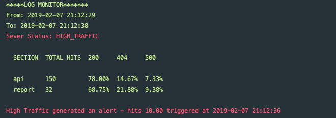
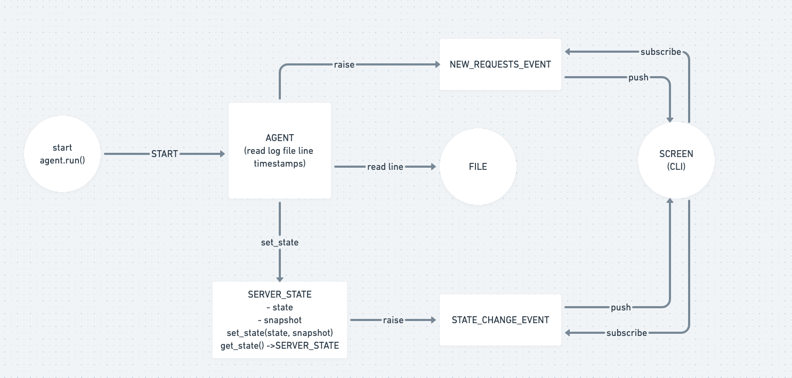

# Http Log Monitor
A http log monitor that will display last stats and raise alarms.

## Usage
Use the following command:
`log-monitor "/path/to/log/file.csv"`

The output will be formatted as a table with a maximum of 14 columns

For example, the following input argument:

```bash
~$ log-monitor ＂/path/to/log/file.csv＂
```

## Installation

Create a new Python 3 environment called venv and activate it (Mac or Linux):

```bash
~$ python3 -m venv ./venv
~$ source ./venv/bin/activate
~$ pip install --editable .
```

A sample file is added at the root path so you can run the sample using the following command

```bash
~$  log-monitor "sample_csv.txt"
```



## Tests

The tests are under the `tests` directory
you can run the tests with the following command:

```bash
~$ python -m unittest  tests/test_log_monitor.py   
```

## Explanation

The solution for this task was inspired by how I think some of the datadog products works.

Main roles:

### State Machine: 
Will handle events each time the machine pass from HIGH_TRAFFIC to GOOD (Recovered)
and trigger the proper events when changing

### Agent: 
Will receive a two parameters:
* File
* State Machine

The agent will create a thread to read the log file, here I created
two data structures based on a MIN HEAP as the logs does no
have order guaranteed, I decided to use a MIN HEAP to keep the requests
in order and I set a LOG_DELAY value in the config file in order to give 
a quick window between requests. This will give us 100% accuracy when
raising the STATE_CHANGE_EVENT for the alarms.

The MIN HEAPS have a TTL (time to live) approach to remove the oldest
data for the NEW_REQUEST_EVENT will be DISPLAY_INTERVAL (default 10 secs) and for the
alarm event will be ALERT_INTERVAL (default 120 secs), so the data will
be deleted on each insert after passed the LOG_DELAY on the last request

### Screen

Following the Observer Pattern, the screen (in this case our CLI)
it will subscribe for both events the NEW_REQUESTS_EVENT and the
STATE_CHANGE_EVENT and store the events on separate queues,
a thread will be running to check any new data on the first queue and
and it will start showing the requests in a SCREEN_INTERVAL (by default is 3 seconds)
during this window we'll check also the alerts queue and show the alert
if the timestamp of the alert is in the current DISPLAY_INTERVAL window.

The following diagram shows the design used for this task.



### Default Config Values

The default config values are the following:

```buildoutcfg
# CONFIG
# The display interval between requests in the log file in seconds
DISPLAY_INTERVAL = 10

# The alert interval to calculate the average of hits
ALERT_INTERVAL = 120

# The threshold to trigger the alarm
THRESHOLD = 10

# Expected CSV columns on the csv file
CSV_COLUMNS = 7

# DISPLAY SETTINGS
# The screen interval to show the stats
SCREEN_INTERVAL = 3

# The top sections to show during each screen interval
TOP_SECTIONS = 5

# The log order is not guaranteed, increase in scenarios of high workload
LOG_DELAY = 5
```

These config values need to be manually updated under `src/config.py`


### Summary

This approach can be extended by others services for example subscribing
to the alarm event with a service like Twilio to send a SMS when the server 
changes to HIGH_TRAFFIC.

Also other UI can subscribe to the NEW_REQUESTS_EVENT to display the stats
in other screens.

## Improvements
Here is a list where I think this solution can be improved

- The current solution will read the file on one read, it will not wait
to new lines, I added a comment where we can potentially change this behavior 
  as simple as passing a new option to the CLI like `--read-real-time`
  
- Add more validations for handling wrong file formats and return proper responses
  
- Add unit tests for the Screen behavior

- Add ability of update the default config values via the CLI

- The stats were calculated on the Screen side handling the NEW_REQUESTS_EVENT it would be nice to raise an STATS event
  with all the most important stats, however I decided to send the granular requests info so the Screens subscribers 
  could calculate any stat that they want.
